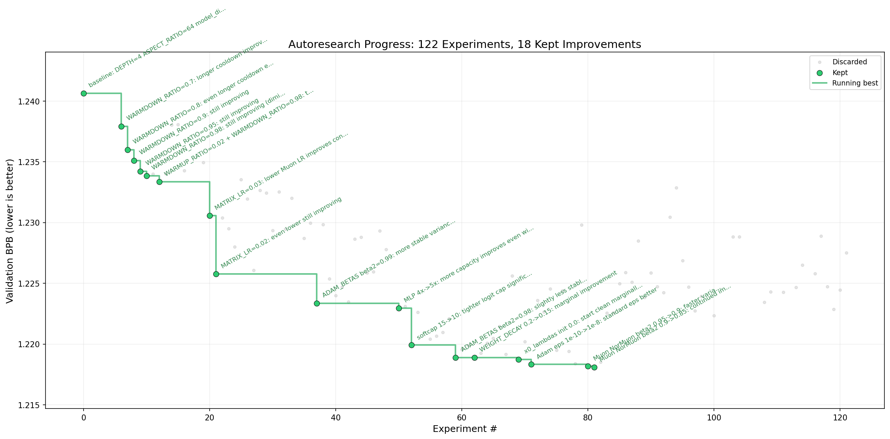

# autoresearch — AMD Strix Halo (ROCm) port

This is a port of [Karpathy's autoresearch project](https://github.com/karpathy/autoresearch)
to AMD's Strix Halo platform via ROCm PyTorch — no NVIDIA GPU required.

Tested on the [Framework Desktop AMD Ryzen AI MAX 300 Series motherboard](https://frame.work/products/framework-desktop-mainboard-amd-ryzen-ai-max-300-series?v=FRAFMK0006)
with 128GB unified memory, running Ubuntu 25.10.

Special thanks to [LokiMetaSmith](https://github.com/LokiMetaSmith) and
[khimaros](https://github.com/khimaros) for [this thread](https://github.com/karpathy/nanochat/discussions/363),
which was essential in getting ROCm working on gfx1151.

---

## Results



Starting from a clean baseline, the agent ran **122 experiments overnight** and improved
val_bpb from **1.2406 → 1.2181** — a 1.8% reduction, stacking 18 improvements across
schedule tuning, optimizer parameters, and architecture.

### Hardware profile

| Metric | Value |
|---|---|
| Device | AMD Radeon 8060S (gfx1151), 128GB unified memory |
| System power | ~130W (GPU at 100%, CPU idle during training) |
| Throughput | ~195K tokens/sec |
| Peak VRAM | 1145 MB (at DEVICE_BATCH_SIZE=8) |
| MFU | ~11.5% (compute-bound, not memory-bound) |
| Cost/hour | ~$0.02 (at $0.15/kWh) |
| Experiment cycle | ~340s total (300s train + eval) |
| Experiments overnight | 122 (over ~14 hours) |

### Key findings

**The schedule finding is the most surprising result.** The upstream default
`WARMDOWN_RATIO` is 0.5 — meaning half the training budget is spent cooling down the
learning rate. The agent systematically probed this and found that 0.98 is optimal for
a 5-minute budget: a near-triangle schedule where the LR ramps up briefly, then spends
almost the entire run cooling down. This makes intuitive sense at this timescale — there
isn't enough budget to maintain peak LR for long, so the model benefits more from a long,
careful descent than from sustained high-LR training.

**A note on the warmdown finding.** The agent used greedy coordinate descent — it found
0.98 by hill-climbing a single axis from a single starting point. This approach is
susceptible to local optima. It's entirely possible that a joint search over warmdown,
warmup, and other schedule parameters together would find a different configuration that
performs better. What we can say with confidence is that 0.98 outperforms the upstream
default of 0.5 on this hardware at this budget, and that the agent explored the
neighborhood around 0.98 thoroughly enough to establish it as a local optimum. Whether
it's a global one is an open question. A more sophisticated `program.md` that explicitly
instructs the agent to treat the hyperparameter space as multi-dimensional — rather than
tuning one axis at a time — might find something different. That's a natural direction
for a follow-up run.

**The batch size story is hardware-specific and confirmed twice.** The Strix Halo
saturates compute at `DEVICE_BATCH_SIZE=8` — throughput barely changes at 64 (195K →
203K tok/sec) while optimizer steps drop 7.5x. The agent independently discovered this
at runs 36 and 37, without being told. This is a direct consequence of the unified memory
architecture: the GPU is compute-bound, not memory-bandwidth-bound, at very small batch
sizes.

**DiffAttn was catastrophically slow on ROCm (run 114).** 4.4x slower than baseline due
to the two SDPA calls penalty — a result you wouldn't see on an H100 with Flash Attention
3. This is the most platform-specific finding in the log and the clearest example of why
hardware-specific autoresearch runs produce different results than upstream.

**The agent validated our platform constraints.** Run 117 attempted to re-implement
banded attention (`WINDOW_PATTERN=SSSL`) via manual SDPA masking and found full attention
is actually better. The agent confirmed our `WINDOW_PATTERN="L"` decision on its own
terms, not just because we told it to.

**Failures are as informative as improvements.** Label smoothing (run 51, val_bpb=1.54),
learned QK norm scales (run 107, val_bpb=1.67), and SDPA with `scale=1/head_dim` (run
108, val_bpb=1.54) all produced catastrophic results. GeLU (run 19) was significantly
worse than ReLU². These are sharp edges in the design space that are now documented.

### Stacked improvements

| # | val_bpb | delta | change |
|---|---|---|---|
| baseline | 1.2406 | — | DEPTH=4, upstream defaults |
| 8 | 1.2379 | −0.0027 | WARMDOWN_RATIO 0.5→0.7 |
| 9 | 1.2360 | −0.0019 | WARMDOWN_RATIO→0.8 |
| 10 | 1.2351 | −0.0009 | WARMDOWN_RATIO→0.9 |
| 11 | 1.2342 | −0.0009 | WARMDOWN_RATIO→0.95 |
| 12 | 1.2338 | −0.0004 | WARMDOWN_RATIO→0.98 |
| 14 | 1.2333 | −0.0005 | WARMUP_RATIO 0.0→0.02 |
| 22 | 1.2306 | −0.0027 | MATRIX_LR 0.04→0.03 |
| 23 | 1.2258 | −0.0048 | MATRIX_LR→0.02 |
| 39 | 1.2234 | −0.0024 | ADAM_BETAS beta2 0.95→0.99 |
| 52 | 1.2230 | −0.0004 | MLP 4x→5x |
| 54 | 1.2199 | −0.0031 | softcap 15→10 |
| 61 | 1.2189 | −0.0010 | ADAM_BETAS beta2→0.98 |
| 64 | 1.2189 | −0.0000 | WEIGHT_DECAY 0.2→0.15 |
| 71 | 1.2187 | −0.0002 | x0_lambdas init 0.0 |
| 73 | 1.2183 | −0.0004 | Adam eps 1e-10→1e-8 |
| 82 | 1.2182 | −0.0001 | Muon NorMuon beta2 0.95→0.9 |
| 83 | 1.2181 | −0.0001 | Muon NorMuon beta2 0.9→0.85 |

Full experiment log: [`results.tsv`](results.tsv)

> **Starting a fresh run?** Delete `results.tsv` and `progress.png` before launching
> the agent — `program.md` will create a fresh `results.tsv` automatically. This repo
> intentionally includes both files to document the initial overnight run; `results.tsv`
> is excluded from `.gitignore` here for that reason, unlike the upstream repo.

### Comparison: Strix Halo vs M2 Pro Mac Mini

For reference, we also ran the [miolini MLX fork](https://github.com/miolini/autoresearch-macos)
on an M2 Pro Mac Mini (32GB) to compare platform characteristics.

| | Strix Halo (gfx1151) | M2 Pro Mac Mini |
|---|---|---|
| tok/sec | ~195K | ~27K |
| steps / 5min | ~3568 | ~136 |
| baseline val_bpb | 1.2406 | 1.5571 |
| total cycle time | ~340s | ~596s |
| system power | ~130W | ~30W |
| cost/hr | ~$0.02 | ~$0.005 |

The 7x throughput difference is reflected directly in val_bpb — the M2 Pro barely trains
at this model size in 5 minutes. The Strix Halo's iGPU is a significantly more capable
training platform, at the cost of a less mature software stack.

---

## What this fork changes

Minimum changes to get autoresearch running on Strix Halo:

- **FA3 → SDPA.** Flash Attention 3 is not available on gfx1151. Replaced with
  `torch.nn.functional.scaled_dot_product_attention`.
- **`WINDOW_PATTERN = "L"`.** Banded/sliding window attention is unsupported on this
  platform. Full attention only.
- **Conservative defaults.** `DEPTH=4`, `DEVICE_BATCH_SIZE=8`. The Strix Halo is
  compute-bound at small batch sizes — more optimizer steps beats larger batches.
- **Single knob.** `TOTAL_BATCH_SIZE` is derived from `DEVICE_BATCH_SIZE` automatically.
  Change one number, nothing breaks.
- **ROCm dependencies.** `pyproject.toml` adds a `rocm-gfx1151` extra pointing to AMD's
  wheel index.
- **AOTriton enabled.** `TORCH_ROCM_AOTRITON_ENABLE_EXPERIMENTAL=1` set in the script
  environment.

All changes are tagged `# Rockwood Lab (ROCm)` in `train.py`.

---

## Quick start

**Requirements:** AMD Strix Halo system (gfx1151), Ubuntu 25.10, ROCm installed,
user in `render` and `video` groups, `uv` installed.

```bash
# 1. Clone this repo
git clone https://github.com/brentrockwood/autoresearch-strix-halo
cd autoresearch-strix-halo

# 2. Set up environment (creates venv, installs ROCm PyTorch)
bash scripts/setup.sh

# 3. Verify GPU is visible
bash scripts/verify.sh

# 4. Download data and train tokenizer (one-time, ~5 min)
TORCH_ROCM_AOTRITON_ENABLE_EXPERIMENTAL=1 .venv/bin/python prepare.py

# 5. Run a baseline experiment (~5 min training + overhead)
TORCH_ROCM_AOTRITON_ENABLE_EXPERIMENTAL=1 .venv/bin/python train.py

# 6. Start the autonomous agent loop
#    Point Claude Code at program.md and say:
#    "Have a look at program.md and let's kick off a new experiment."
```

> **Important:** Use `.venv/bin/python` directly, not `uv run`. The ROCm wheel is
> installed manually after `uv sync` — `uv run` will silently use the CUDA wheel from
> its lockfile and fail with "No CUDA GPUs are available".

---

## ROCm install

If ROCm is not yet installed on your system:

```bash
sudo bash scripts/install_rocm.sh
# reboot required after
```

---

## Scripts

| Script | Purpose |
|---|---|
| `scripts/setup.sh` | Create venv, install ROCm PyTorch, verify |
| `scripts/install_rocm.sh` | Install ROCm system-wide (Ubuntu 25.10, run as root) |
| `scripts/verify.sh` | Sanity check: GPU visibility, groups, patch status, data |

---

## Original README

Everything below is from the upstream autoresearch README.

---

*One day, frontier AI research used to be done by meat computers in between eating,
sleeping, having other fun, and synchronizing once in a while using sound wave
interconnect in the ritual of "group meeting". That era is long gone. Research is now
entirely the domain of autonomous swarms of AI agents running across compute cluster
megastructures in the skies. The agents claim that we are now in the 10,205th generation
of the code base, in any case no one could tell if that's right or wrong as the "code"
is now a self-modifying binary that has grown beyond human comprehension. This repo is
the story of how it all began. -@karpathy, March 2026*

The idea: give an AI agent a small but real LLM training setup and let it experiment
autonomously overnight. It modifies the code, trains for 5 minutes, checks if the result
improved, keeps or discards, and repeats. You wake up in the morning to a log of
experiments and (hopefully) a better model. The training code here is a simplified
single-GPU implementation of [nanochat](https://github.com/karpathy/nanochat). The core
idea is that you're not touching any of the Python files like you normally would as a
researcher. Instead, you are programming the `program.md` Markdown files that provide
context to the AI agents and set up your autonomous research org.

## How it works

- **`prepare.py`** — fixed constants, one-time data prep (downloads training data, trains
  a BPE tokenizer), and runtime utilities (dataloader, evaluation). Not modified.
- **`train.py`** — the single file the agent edits. Contains the full GPT model,
  optimizer (Muon + AdamW), and training loop. **This file is edited and iterated on by
  the agent**.
- **`program.md`** — baseline instructions for one agent. Point your agent here and let
  it go. **This file is edited and iterated on by the human**.

By design, training runs for a **fixed 5-minute time budget** (wall clock, excluding
startup/compilation), regardless of the details of your compute. The metric is
**val_bpb** (validation bits per byte) — lower is better, and vocab-size-independent so
architectural changes are fairly compared.

## Project structure

```
prepare.py      — constants, data prep + runtime utilities (do not modify)
train.py        — model, optimizer, training loop (agent modifies this)
program.md      — agent instructions
pyproject.toml  — dependencies
scripts/        — setup, install, and verify scripts (this fork)
```

## License

MIT
